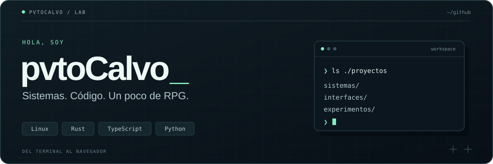

  

  <a href="#proyectos-destacados">Proyectos</a> &nbsp; / &nbsp;
  <a href="https://github.com/pvtoCalvo/cv_rpg">Mi CV en modo RPG</a> &nbsp; / &nbsp;
  <a href="https://github.com/pvtoCalvo?tab=repositories">Todos los repositorios</a>

### Del terminal al navegador.

Construyo herramientas para Linux, exploro infraestructura y desarrollo interfaces web. Aquí conviven un gestor de firewall en Rust, un CV convertido en RPG y pequeños experimentos con código.

## Proyectos destacados

<table>
  <tr>
    <td width="50%" valign="top">
      01 / SISTEMAS
      <h3><a href="https://github.com/pvtoCalvo/IP_NF_Tables_Helper">Firewall, desde el terminal</a></h3>
      
Una TUI para administrar nftables e iptables: reglas, copias de seguridad, restauración y modo dry-run.

      
<code>Rust</code> <code>ratatui</code> <code>Linux</code>

      <a href="https://github.com/pvtoCalvo/IP_NF_Tables_Helper">Explorar IP_NF_Tables_Helper →</a>
    </td>
    <td width="50%" valign="top">
      02 / INTERFACES
      <h3><a href="https://github.com/pvtoCalvo/cv_rpg">Un CV con puntos de experiencia</a></h3>
      
Portfolio interactivo con estética RPG y pixel art, experiencia por niveles, versión ES/EN y exportación a PDF.

      
<code>React</code> <code>TypeScript</code> <code>Vite</code>

      <a href="https://github.com/pvtoCalvo/cv_rpg">Explorar cv_rpg →</a>
    </td>
  </tr>
</table>

### También en el laboratorio

| Proyecto | Qué encontrarás | Tecnologías |
| :--- | :--- | :--- |
| [Vitess15Linkeding](https://github.com/pvtoCalvo/Vitess15Linkeding) | Configuración inicial de un clúster Vitess y sus componentes. | `Vitess` `Kubernetes` `MySQL` |
| [NonRepeatedSTR](https://github.com/pvtoCalvo/NonRepeatedSTR) | Un experimento con cadenas y caracteres no repetidos. | `Python` |

---

Herramientas útiles, interfaces con personalidad y curiosidad por cómo funcionan las cosas.

